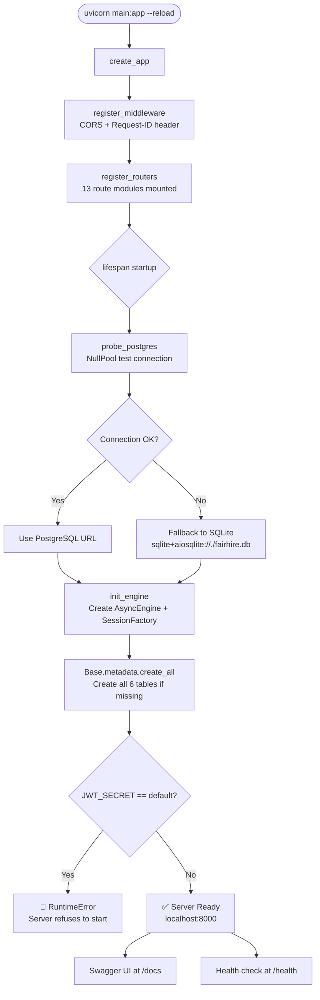
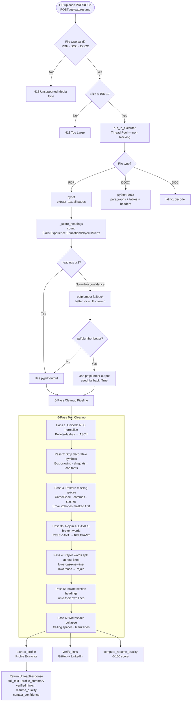
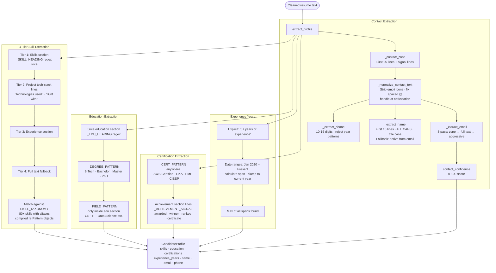
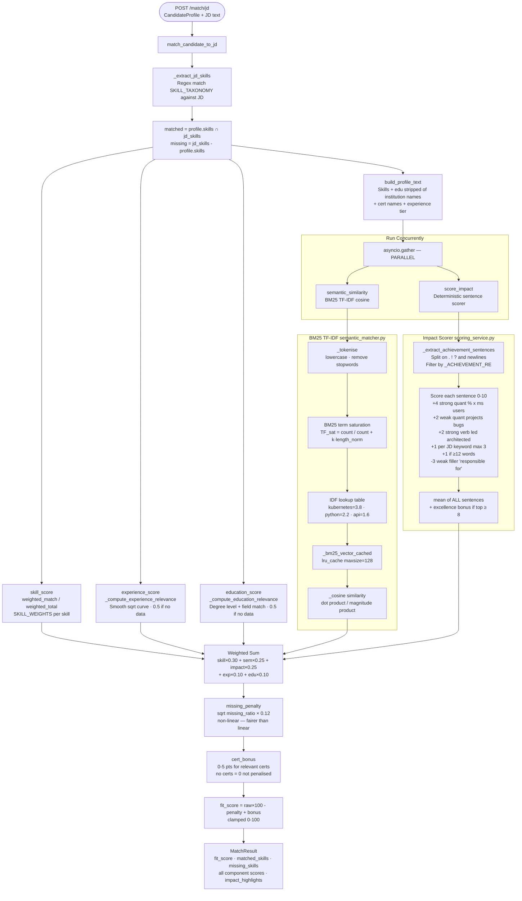
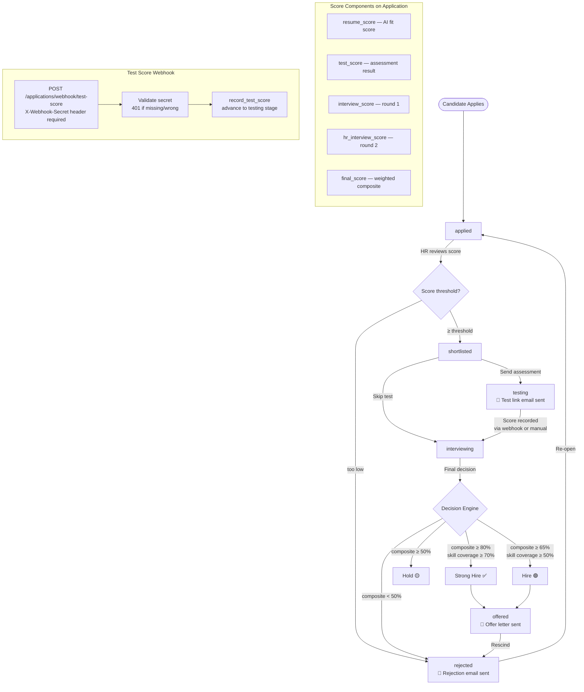
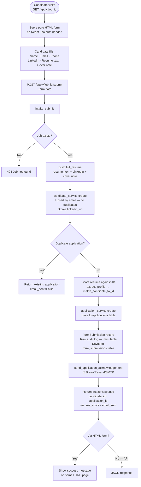
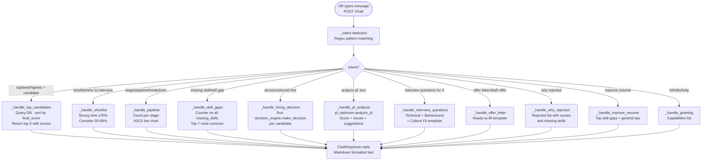
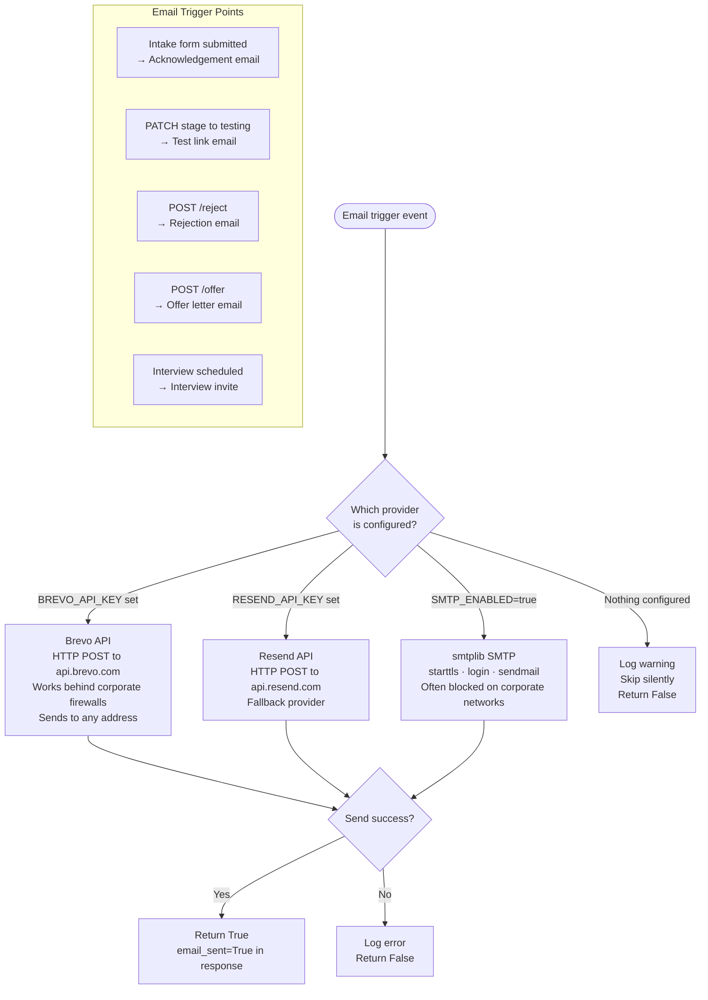
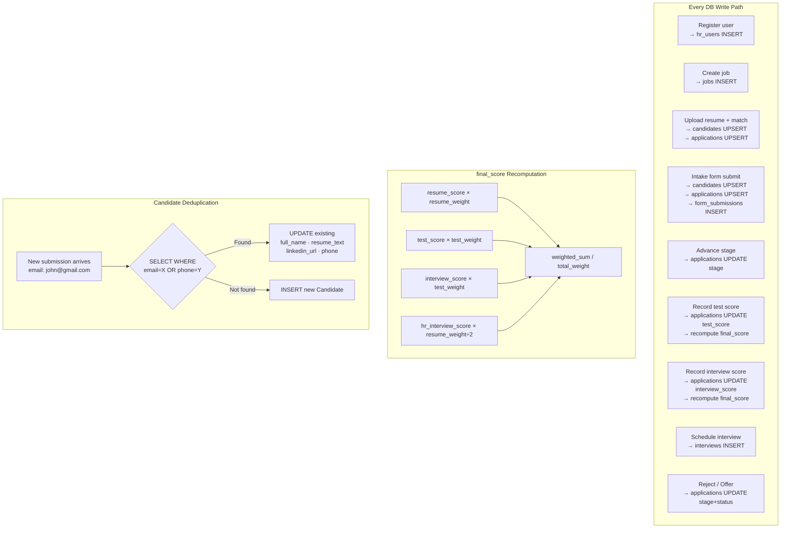

# FairHire AI — Complete Project Flowchart
# Open this file in any Mermaid renderer:
# - https://mermaid.live
# - VS Code Mermaid Preview extension
# - GitHub (renders automatically in .md files)

---

## FLOWCHART 1 — Full System Architecture

```mermaid
flowchart TD
    subgraph CLIENT["🖥️ FRONTEND  React + TypeScript + Vite"]
        LAND[Landing Page]
        LOGIN[Login Page\nEmail/Password\nGoogle OAuth]
        DASH[Dashboard\nMetrics + Analytics]
        JOBS[Jobs Page\nCreate / Publish]
        PIPE[Pipeline Page\nStage Management]
        CANDS[Candidates Page]
        PROF[Candidate Profile]
        INTV[Interviews Page]
        PROC[Process Resumes]
        CHAT[RecruiterChat\nFloating Widget]
    end

    subgraph AUTH_FLOW["🔐 AUTH LAYER"]
        JWT[JWT Token\nHS256 · 8hr expiry]
        GOOG[Google OAuth2\nAuthorization Code Flow]
    end

    subgraph BACKEND["⚙️ BACKEND  FastAPI + asyncpg"]
        subgraph ROUTES["API Routes  /api/v1/"]
            R_AUTH[/auth/\nregister · login · google]
            R_JOBS[/jobs/\nCRUD · publish]
            R_UPLOAD[/upload/resume\nParse + Profile]
            R_MATCH[/match/jd\nFit Scoring]
            R_APPS[/applications/\nPipeline CRUD]
            R_INTV[/interviews/\nSchedule + Score]
            R_CHAT[/chat/\nChatbot]
            R_ANAL[/analytics/summary]
            R_INTAKE[/intake/submit\nPublic API]
            R_APPLY[/apply/job_id\nPublic HTML Form]
        end

        subgraph SERVICES["Services Layer"]
            SVC_PARSE[parser.py\npypdf → pdfplumber]
            SVC_PROF[profile_extractor.py\nRegex Pipeline]
            SVC_JD[jd_matcher.py\nHybrid Scoring]
            SVC_SEM[semantic_matcher.py\nBM25 TF-IDF]
            SVC_IMP[scoring_service.py\nImpact Scorer]
            SVC_TAX[skill_taxonomy.py\n80+ Skills]
            SVC_DEC[decision_engine.py\nHire/Hold/Reject]
            SVC_EMAIL[email_service.py\nBrevo/Resend/SMTP]
            SVC_JDO[jd_optimizer.py\nJD Quality]
            SVC_QUAL[resume_quality.py\n0-100 Score]
            SVC_LINK[link_verifier.py\nGitHub/LinkedIn]
        end
    end

    subgraph DB["🗄️ PostgreSQL  6 Tables"]
        T_USERS[(hr_users)]
        T_JOBS[(jobs)]
        T_CANDS[(candidates)]
        T_APPS[(applications)]
        T_INTV[(interviews)]
        T_FORMS[(form_submissions)]
    end

    LOGIN -->|email+password| R_AUTH
    LOGIN -->|OAuth code| GOOG
    GOOG -->|exchange code| R_AUTH
    R_AUTH --> JWT
    JWT -->|stored in localStorage| CLIENT

    PROC --> R_UPLOAD
    JOBS --> R_JOBS
    PIPE --> R_APPS
    CANDS --> R_MATCH
    INTV --> R_INTV
    CHAT --> R_CHAT
    DASH --> R_ANAL

    R_UPLOAD --> SVC_PARSE
    SVC_PARSE --> SVC_PROF
    SVC_PROF --> SVC_TAX
    SVC_PROF --> SVC_LINK
    SVC_PROF --> SVC_QUAL

    R_MATCH --> SVC_JD
    SVC_JD --> SVC_SEM
    SVC_JD --> SVC_IMP
    SVC_JD --> SVC_TAX

    R_APPS --> SVC_DEC
    R_APPS --> SVC_EMAIL
    R_CHAT --> SVC_DEC
    R_CHAT --> SVC_JDO

    R_APPLY --> R_INTAKE
    R_INTAKE --> SVC_PROF
    R_INTAKE --> SVC_JD
    R_INTAKE --> SVC_EMAIL

    BACKEND --> DB
```

---

## FLOWCHART 2 — Server Startup Sequence



---

## FLOWCHART 3 — Authentication Flow

```mermaid
flowchart TD
    subgraph EMAIL_AUTH["Email / Password Auth"]
        A1[User fills Login form] --> B1{Mode?}
        B1 -->|Register| C1[POST /auth/register\nemail · password · full_name]
        B1 -->|Login| D1[POST /auth/login\nOAuth2PasswordRequestForm]
        C1 --> E1[hash_password\npasslib bcrypt]
        E1 --> F1[Save HRUser\nrole hardcoded = 'hr']
        D1 --> G1[verify_password\nbcrypt compare]
        G1 -->|Match| H1[create_access_token\npython-jose HS256]
        F1 --> H1
        H1 --> I1[Return JWT\nuser_id · email · role]
        I1 --> J1[Store in localStorage\nquantumlogic_token]
    end

    subgraph GOOGLE_AUTH["Google OAuth2 Flow"]
        A2[Click 'Continue with Google'] --> B2[Redirect to\naccounts.google.com/o/oauth2/v2/auth\nscope: openid email profile]
        B2 --> C2[User picks Google account]
        C2 --> D2[Google redirects to\n/auth/google/callback?code=XXX]
        D2 --> E2[GoogleCallback.tsx\nextracts code from URL]
        E2 --> F2[POST /auth/google\ncredential: code]
        F2 --> G2[httpx POST to\noauth2.googleapis.com/token\nexchange code for id_token]
        G2 --> H2[id_token.verify_oauth2_token\ngoogle-auth library]
        H2 -->|Valid| I2{User exists?}
        I2 -->|No| J2[Create HRUser\nrole = 'hr']
        I2 -->|Yes| K2[Fetch existing user]
        J2 --> L2[create_access_token]
        K2 --> L2
        L2 --> M2[Return JWT]
        M2 --> N2[Navigate to /dashboard]
    end

    subgraph PROTECTED["Every Protected Request"]
        P1[Request with\nAuthorization: Bearer TOKEN] --> P2[get_current_user dependency]
        P2 --> P3[decode_token\npython-jose]
        P3 -->|Invalid/Expired| P4[401 Unauthorized\nFrontend clears localStorage]
        P3 -->|Valid| P5[db.get HRUser by sub]
        P5 --> P6[Route handler executes]
    end
```



---

## FLOWCHART 4 — Resume Upload & Parsing Pipeline



---

## FLOWCHART 5 — Profile Extraction (Regex Pipeline)



---

## FLOWCHART 6 — AI Fit Scoring Pipeline



---

## FLOWCHART 7 — Hiring Pipeline (Stage Machine)



---

## FLOWCHART 8 — Public Application Form Flow



---

## FLOWCHART 9 — Recruiter Chatbot Flow



---

## FLOWCHART 10 — Frontend Navigation & State

```mermaid
flowchart TD
    subgraph PROVIDERS["Context Providers wrap entire app"]
        P1[AuthProvider\nuser · token · login · googleLogin · logout\n401 interceptor]
        P2[JobProvider\nactive job persisted in localStorage]
        P3[PipelineProvider\npipeline stage data]
    end

    A([User visits app]) --> B{isAuthenticated?}
    B -->|No| C[Landing Page /]
    C --> D[Login Page /login]
    D -->|Email/Password| E[AuthContext.login\nPOST /auth/login]
    D -->|Google button| F[Redirect to Google OAuth]
    F --> G[/auth/google/callback\nGoogleCallback.tsx\nspinner while processing]
    G --> H[AuthContext.googleLogin\nPOST /auth/google]

    E --> I[JWT stored\nNavigate to /dashboard]
    H --> I

    B -->|Yes| I

    I --> J[Dashboard\nMetrics · Score distribution\nTop candidates · AI insights]
    J --> K[Jobs Page\nCreate job · Set JD · Publish]
    K --> L[Process Resumes\nUpload PDF/DOCX\nSee profile + score]
    L --> M[Pipeline Page\nStage-grouped table\nAdvance · Reject · Offer]
    M --> N[Candidates Page\nAll candidates list]
    N --> O[Candidate Profile\nFull details · scores · links]
    M --> P[Interviews Page\nSchedule · Score rounds]

    J --> Q[RecruiterChat\nFloating widget\nalways visible when logged in]

    subgraph AXIOS["Axios API Client  services/api.ts"]
        AX1[Base URL: /api/v1]
        AX2[JWT injected in\nAuthorization header]
        AX3[401 response → clearAuth\nauto logout]
    end
```

---

## FLOWCHART 11 — Email Notification System



---

## FLOWCHART 12 — Database Write Flow (Complete)


